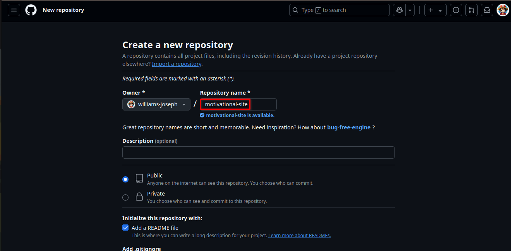
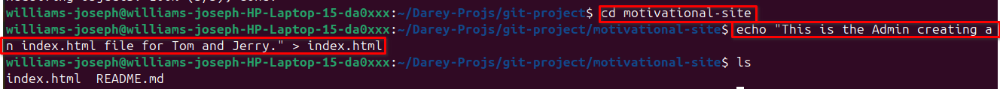
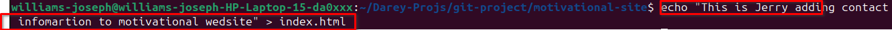

# Hands-On Git Project: Collaborative Website Development with Git and GitHub

In this mini project, I simulated the Git and GitHub collaboration workflow of two developers, **Tom** and **Jerry**, using a single machine running Ubuntu.

Although I used one Git user locally, I distinguished between the tasks performed by Tom and Jerry through clear commit messages and screenshots, which are included in this documentation.

## What I Did

- ✅ Installed Git on my Ubuntu system.
- ✅ Created a new repository on GitHub.
- ✅ Cloned the repository to my local machine.
- ✅ Created separate branches to simulate Tom's and Jerry's contributions.
- ✅ Made specific changes:
  - **Tom** added a "Blog" link to the navigation.
  - **Jerry** added contact information to the footer.
- ✅ Committed and pushed each change to GitHub with appropriate messages.
- ✅ Merged the branches back into the `main` branch after completing the tasks.

## Purpose

This project helped me practice:

- Git basics and common workflows
- Working with branches and merge operations
- Simulating collaborative development in a version-controlled environment

## Screenshots

Screenshots documenting each stage of the workflow are located in the `Images/` folder. These images clearly distinguish which changes were made by **Tom** and which by **Jerry**.

Each screenshot corresponds to:

- Git branch creation
- File edits
- Git add & commit actions
- Pushes to the remote repository
- Merge actions into `main`

You can view the screenshots directly in the `Images/` directory or link to them below:

**Install Git**
---

Git is stored.

**Create Repository**
---
Created Repository named `motivational-site`

**Clone Repository**
---

Created a directory called `git-project` and cloned the remote repository on local machine.

**Navigate Into Clone Repository**
---

Navigated into cloned repo directory `motivational-site` and created `index.html` with this text; ___'This is the Admin creating an index.html file for Tom and Jerry.'___

**Added, staged  and committed the changes.**
---

Checked the `status` of changes, staged them, commit and pushed with necessary `git-commands`. The branch was confirmed to be on `main` before `push`.

**Simulating Tom and Jerry's work**
---
To simulate Tom and Jerry working on the same laptop, switched between two branches, each branch for both of them.

### Tom's Work
---
Firstly, Tom created another branch called `update-navigation`, went on to check branch to see new branch before making any modifications. He modifies the `index.html` adding '___This is Tom adding Navigation to motivational site___.' confirming his contribution to the project.

There was an error while Tom making a modification, below screenshot is the correction made.

Tom's changes were staged, committed and pushed.

### Jerry's Work
---
Before I can simulate Jerry's work, i have to return to the `main` branch and create another branch named `add-contact-info`.

In the screenshot above I changed back to the `main` branch. Then used `git pull` to merge changes in `update-navigation` branch to the `main` branch.

---
Now Jerry creates another branch with this Git commnand `git checkout -b add-contact-info`. It is to note that the inclusion of `-b` in the command is to create another branch which is not the first branch in the repo. It is used to create subsequent branches after the first branch has been created.

Jerry modifies the `index.html` adding '___This is Jerry adding contact information to motivational site___'. 

Jerry then stages his changes, commits and push to Github. Used necessary git command to check and confirm changes.

Jerry changes to the `main` branch, merges his changes to `main` and finally push to github.

## Git Log

To track the commit history and simulate individual contributions, I used the following Git command: `git log`

---
## Notes

> 📌 Screenshots provided in this project clearly distinguish the tasks completed by Tom and Jerry.

---

